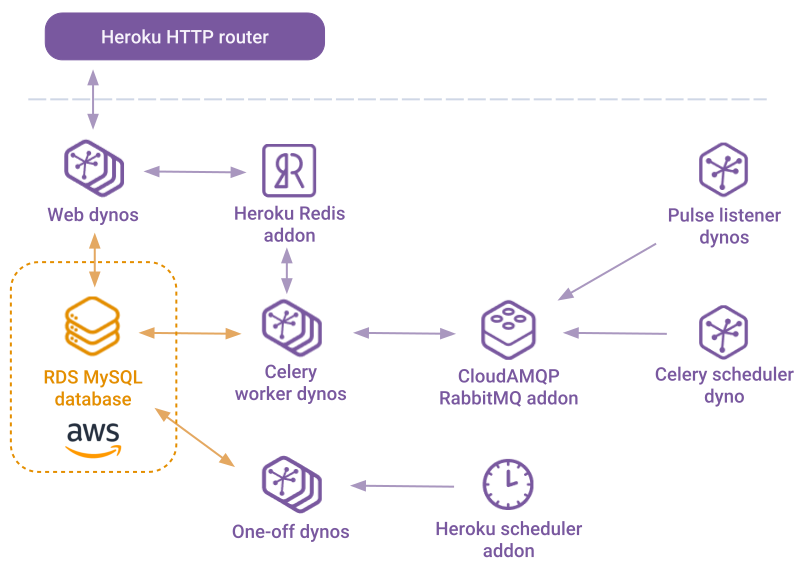

# Architecture

## Overview

Treeherder is a Django-based Python 3 application that consumes CI data from a variety of
sources - making it available via REST APIs to a static Neutrino/webpack-built
React frontend.

Treeherder's [production], [stage] and [prototype] instances are hosted on the [Heroku platform],
however [Amazon RDS] is used for their MySQL databases. These RDS instances are owned by the
`moz-devservices` AWS account and to reduce latency are in the same AWS region (`us-east-1`) as
Heroku's US [common runtime].

[production]: https://treeherder.mozilla.org
[stage]: https://treeherder.allizom.org
[prototype]: https://treeherder-prototype.herokuapp.com
[heroku platform]: https://www.heroku.com
[amazon rds]: https://aws.amazon.com/rds/
[common runtime]: https://devcenter.heroku.com/articles/dyno-runtime

The apps are structured like so:

<!--
Diagram exported from:
https://docs.google.com/drawings/d/1Zv8zbdVkpIf8FiDvfc1AaTRhEJed8Pwe7kwAgkTS1zQ/edit
-->

To learn more about Heroku, see [How Heroku Works] and their [Python app tutorial].

[how heroku works]: https://devcenter.heroku.com/articles/how-heroku-works
[python app tutorial]: https://devcenter.heroku.com/articles/getting-started-with-python

## Web requests

Incoming requests are directed to web [dynos] by Heroku's [HTTP router], which also
terminates TLS. Certificates are automatically renewed by the Let's Encrypt-powered
[Automated Certificate Management] feature.

On each web dyno, the Django WSGI app is served directly using [gunicorn], which also
handles requests for static assets via the Django middleware [WhiteNoise]. In the future
the frontend may be hosted separately using Netlify instead, see [bug 1504996].

[dynos]: https://devcenter.heroku.com/articles/dynos
[http router]: https://devcenter.heroku.com/articles/http-routing
[automated certificate management]: https://devcenter.heroku.com/articles/automated-certificate-management
[gunicorn]: https://gunicorn.org
[whitenoise]: http://whitenoise.evans.io
[bug 1504996]: https://bugzilla.mozilla.org/show_bug.cgi?id=1504996

## Background tasks

Background tasks are primarily managed using [Celery] with [RabbitMQ] as a broker.
The RabbitMQ instances are provided by the [CloudAMQP Heroku addon].

Version control pushes and CI job result data is consumed from Mozilla's event stream, [Pulse],
via dynos running [Kombu]-powered Django management commands. These do not ingest the data
themselves, instead adding tasks to internal queues for the Celery workers to process.
The Celery workers then handle the storing of this push/job data, along with tasks spawned
as a result (such as the parsing of logs associated with those jobs).

For more details on process/worker types, see Treeherder's [Procfile].

There are also tasks that are run on a schedule, triggered via either:

1. Heroku's [scheduler addon]

   This runs the commands configured within the addon in [one-off dynos] at the chosen
   interval (see [adjusting scheduled tasks]).

   The tasks it currently runs are:

   - `update_bugscache` (hourly)
   - `cycle_data` (daily)
   - `run_intermittents_commenter` (daily)

2. The `celery_scheduler` dyno

   This schedules the tasks listed in `CELERY_BEAT_SCHEDULE` in `settings.py`, which are
   then processed by the `worker_misc` Celery worker dyno. However we're moving away from
   using this in favour of the Heroku scheduler addon (see [deps of bug 1176492]).

[celery]: http://celeryproject.org
[rabbitmq]: https://www.rabbitmq.com
[cloudamqp heroku addon]: https://elements.heroku.com/addons/cloudamqp
[pulse]: https://wiki.mozilla.org/Auto-tools/Projects/Pulse
[kombu]: https://kombu.readthedocs.io
[procfile]: https://github.com/mozilla/treeherder/blob/master/Procfile
[scheduler addon]: https://devcenter.heroku.com/articles/scheduler
[adjusting scheduled tasks]: administration.md#adjusting-scheduled-tasks
[one-off dynos]: https://devcenter.heroku.com/articles/one-off-dynos
[deps of bug 1176492]: https://bugzilla.mozilla.org/showdependencytree.cgi?id=1176492&hide_resolved=1

## Deployment lifecycle

The Heroku apps are linked to [Treeherder's repository] using Heroku's [GitHub integration],
and each instance is normally set to auto-deploy from specific branches (see
[Deploying Treeherder]).

[treeherder's repository]: https://github.com/mozilla/treeherder
[github integration]: https://devcenter.heroku.com/articles/github-integration
[deploying treeherder]: administration.md#deploying-treeherder

Once a Treeherder deployment is initiated, the following occurs:

1. Building the application "slug"

   - The Treeherder source code is checked out from GitHub.
   - Files matching [.slugignore] entries are removed.
   - The [buildpacks] configured on the app are invoked, which in our case are:

     1. [heroku-buildpack-nodejs]: Installs Node.js and Yarn (using the versions from
        `package.json`), runs `yarn install`, then builds the Treeherder frontend via
        `yarn heroku-postbuild`.

     2. [heroku-buildpack-python]: Installs Python (using the version from `runtime.txt`),
        pip installs Python dependencies (using `requirements.txt`), for Django apps runs
        [collectstatic], then triggers our custom [bin/post_compile] script.

   - The results of the above are packaged into a compressed tar archive known as a "slug".

2. Creating a "release"

   - The slug from the build step is combined with the [config variables] set on the app,
     to form a [release].
   - The [Release Phase] feature runs our custom [bin/pre_deploy] script.

3. Running the new release

   - The existing [dynos] are [shutdown].
   - New dynos are spun up using the newly-created release with the process types/commands
     specified in our [Procfile].

[.slugignore]: https://devcenter.heroku.com/articles/slug-compiler#ignoring-files-with-slugignore
[buildpacks]: https://devcenter.heroku.com/articles/buildpacks
[heroku-buildpack-nodejs]: https://github.com/heroku/heroku-buildpack-nodejs
[heroku-buildpack-python]: https://github.com/heroku/heroku-buildpack-python
[collectstatic]: https://docs.djangoproject.com/en/2.1/ref/contrib/staticfiles/#collectstatic
[bin/post_compile]: https://github.com/mozilla/treeherder/blob/master/bin/post_compile
[config variables]: https://devcenter.heroku.com/articles/config-vars
[release]: https://devcenter.heroku.com/articles/releases
[release phase]: https://devcenter.heroku.com/articles/release-phase
[bin/pre_deploy]: https://github.com/mozilla/treeherder/blob/master/bin/pre_deploy
[shutdown]: https://devcenter.heroku.com/articles/dynos#shutdown

<!-- prettier-ignore -->
!!! note
    Heroku follows the [twelve-factor app] principal of having three distinct phases
    for the deployment process: [build, release and run]. Whilst all three phases occur
    for a standard deployment, that is not always the case.

    For example, when [updating environment variables] or [performing a rollback] the build
    step is skipped and a new release created that re-uses the slug from a previous build.
    This is why it is important to only interact with external services (such as running
    DB migrations or notifying New Relic about a deployment) during the release step (using
    [Release Phase]) and not during the build.

[twelve-factor app]: https://12factor.net
[build, release and run]: https://devcenter.heroku.com/articles/runtime-principles#build-release-run
[updating environment variables]: administration.md#environment-variables
[performing a rollback]: administration.md#reverting-deployments
